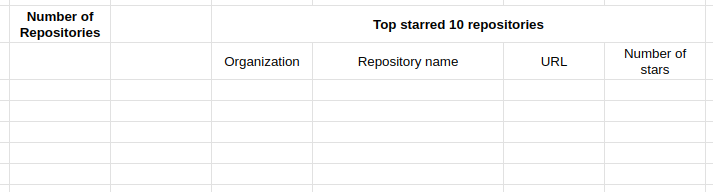

# Ballerina GitHub Repository Count And Top Starred Repositories

This Ballerina program will find the count of GitHub repositories that are mainly based off Ballerina language and the top starred repositories.
Upon finding the repositories count and the top starred repositories, it will update the google spreadsheet with the fetched details.

The following details will be stored related to the top starred repositories :
- Repository Organization
- Repository Name
- URL to the repository
- Number of Stars

## Prerequisites

- Download and install [Ballerina](https://ballerina.io/downloads/)
- Create a GitHub personal access token. Follow the instructions in [Creating a personal access token](https://docs.github.com/en/github/authenticating-to-github/creating-a-personal-access-token) to create a personal access token.
- Create a `Config.toml` file in the root directory of the project and add the following configurations.

    ```toml
    GITHUB_TOKEN="<GitHub Personal Access Token>"
    CLIENT_ID="<Google OAuth Client ID>"
    CLIENT_SECRET="<Google OAuth Client Secret>"
    REFRESH_TOKEN="<Google OAuth Refresh Token>"
    SPREADSHEET_ID="<SpreadSheet ID That You are Going to Edit>"
    SHEET_NAME="<Worksheet Name That is Available at Left Bottom Corner>"
    REPO_COUNT_CELL="<CELL A1 Notation to Store Repository Count>"
    TOP_REPO_START_CELL="<CELL A1 Notation to Indicate Where The Repository List Starts>"
    TOP_REPO_COUNT="<Number of Top Starred Repositories You Want to List>"
    TOP_REPO_END_COLUMN="<Column Letter Where The List Ends>"
    TOP_REPO_HEADER_CELL="<Cell Range In Which The Header Of The List Resides>"
    ```
- Please note:
    - Spreadsheet cell details that are specified in the Toml file followes a specific structure. 
    - Check the following image for the template.

        

- Run the program with the following command.

    ```bash
    bal run -- <org1> <org2> <org3>
    ```
- In the above command, arguments refer to the github organizations that we want to exclude from the search results. There can be variable number of arguments.

- Example usage :

    ```bash
    bal run -- ballerina-platform ballerina-attic
    ```
